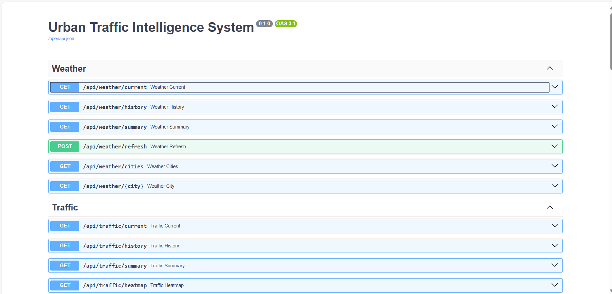
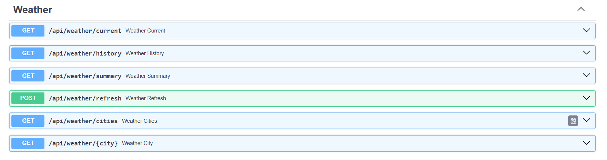
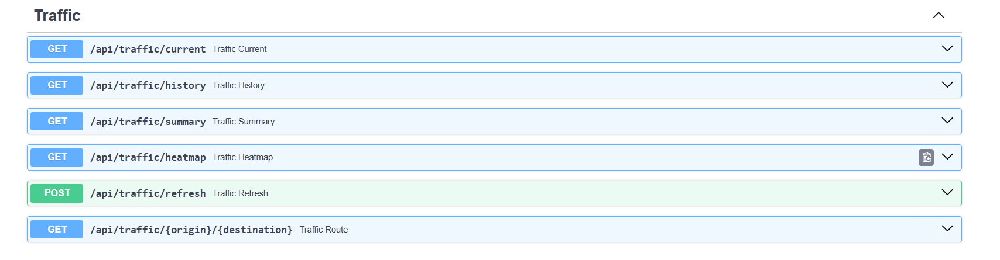
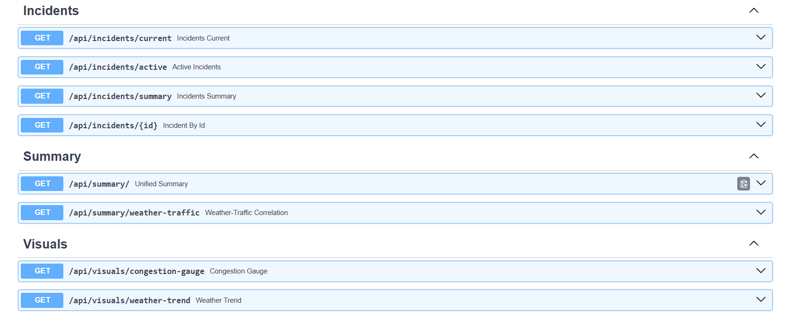

# UTIS Backend: Traffic, Weather & Incident API

## Project Overview

The UTIS backend provides **traffic, weather, and incident data** for London via a REST API, collected through an ETL pipeline and stored in PostgreSQL.  

**Key Features:**

- Real-time data collection from OpenWeatherMap & TfL API  
- ETL pipeline with validation, trend analysis, and correlation computation  
- REST API endpoints for current, historical, summary, and visualization data  
- PostgreSQL storage with upserts to prevent duplicate records  
- Sample JSON exports and system health monitoring endpoints  

**Technologies Used:**

- Python 3.11, FastAPI, SQLAlchemy, Pydantic  
- PostgreSQL (AWS RDS)  
- Docker, Docker Compose  
- Optional: Cloud Run / Cloud Build for deployment  

---

## Setup Instructions

### 1. Clone the repository

```bash
    git clone https://github.com/nnoromiv/backend.git
```

### 2. Install dependencies

```bash
    pip install -r requirements.txt
```

### 3. Set Environment Variables

Create a `.env` file:

```bash
    POSTGRES_HOST=<your_postgres_host>
    POSTGRES_PORT=5432
    POSTGRES_DB=utis_db
    POSTGRES_USER=<your_postgres_user>
    POSTGRES_PASSWORD=<your_postgres_password>
    API_KEY=<openweathermap_api_key>
```

### 4. Initialize the Database

```bash
    python init_db.py
```

### 5. Run FastAPI Server

```bash
    uvicorn main:app --reload --host 0.0.0.0 --port 8000
```

### 6. Test API Endpoints

Open Swagger UI:

```bash
    http://127.0.0.1:8000/docs
```

**Key endpoints:**

- `/api/weather/current` – Latest weather for all cities
- `/api/traffic/current` – Latest traffic for all routes
- `/api/incidents/current` – Active incidents
- `/api/summary/weather-traffic` – Weather ↔ traffic correlation
- `/api/data/sample` – Latest 5 records from all tables
- `/api/system/health` – Database connection & freshness check

### 7. Optional Docker Deployment

```bash
    docker build -t utis-backend .
    docker run -p 8000:8000 --env-file .env utis-backend
```

---

## Architecture Decisions

- **FastAPI:** Chosen for high performance, automatic OpenAPI docs, and type-safe request/response validation.
- **PostgreSQL:** Reliable relational database with indexing and upserts for ETL data integrity.
- **SQLAlchemy + Pydantic:** Clear ORM mapping and schema validation for pipeline data.
- **ETL Pipeline:** Extract → Validate → Transform → Load, ensuring accurate trends and correlations.
- **REST API Design:** Separate endpoints for current, historical, summary, and visual data to support dashboards and external clients.
- **Dockerized Deployment:** Ensures reproducibility, consistent environments, and cloud readiness.

---

## Challenges Faced & Solutions

| Challenge                                      | Solution                                                                  |
| ---------------------------------------------- | ------------------------------------------------------------------------- |
| Anti-bot scraping from Google Maps/Waze        | Switched to official TfL API                                              |
| Duplicate or inconsistent records              | Implemented Pydantic validation & PostgreSQL upserts                      |
| Database connection errors in cloud deployment | Configured backend to use public AWS RDS endpoint & environment variables |
| Container startup issues on Cloud Run          | Ensured containers listen on `$PORT` and removed OS-specific dependencies |
| Expensive queries for summaries                | Optional caching and optimized SQL queries                                |

---

## Example API Screenshots

**Swagger UI Overview**


**Weather Endpoint**


**Traffic Endpoint**


**Incidents & Other Endpoint**


---

## License

MIT License © 2025 Nnorom Christian
